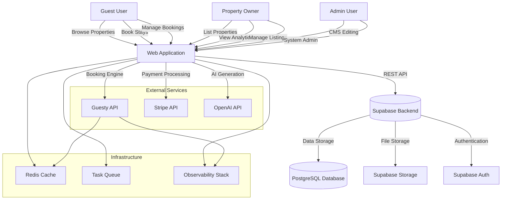
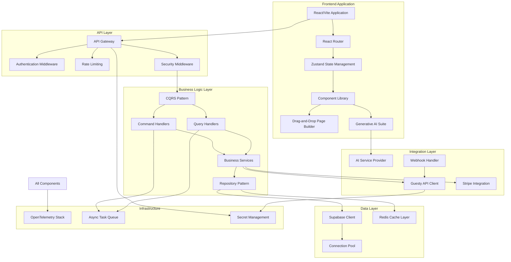
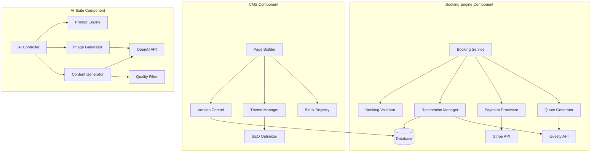
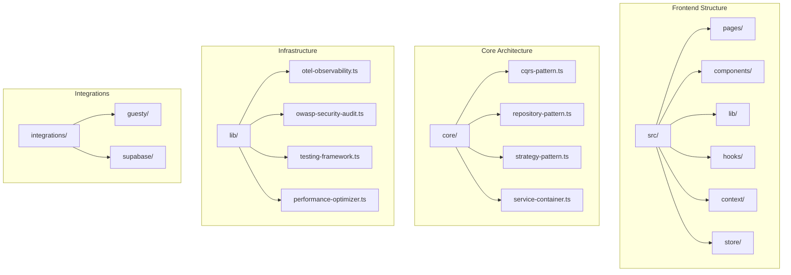

# Christiano Vincenti Property Management - Enterprise Architecture

**Hyper-Scalable, Zero-Trust, Enterprise-Grade Production Ecosystem**

A sophisticated, CMS-driven, AI-augmented property management platform featuring high-fidelity Drag-and-Drop Page Builder, Generative AI suite, and seamless Stripe-integrated E2E booking engine with Guesty API orchestration.

---

## 🏗️ System Architecture (C4 Model)

### Level 1: System Context



### Level 2: Container View



### Level 3: Component View



### Level 4: Code View



---

## 🚀 Technology Stack

### Frontend
- **Framework**: React 18.3+ with TypeScript 5.8+
- **Build Tool**: Vite 8.0+ with SWC compilation
- **State Management**: Zustand 5.0+ with DevTools
- **Routing**: React Router DOM 6.30+
- **UI Components**: Radix UI primitives with shadcn/ui
- **Styling**: Tailwind CSS 3.4+ with custom design system
- **Forms**: React Hook Form 7.61+ with Zod validation
- **Drag & Drop**: @dnd-kit with Sortable utilities
- **Rich Text**: Tiptap 3.19+ editor framework
- **Charts**: Recharts 2.15+ for analytics
- **3D/AR**: Three.js via TensorFlow.js integration

### Backend & Database
- **BaaS**: Supabase (PostgreSQL 15+, Auth, Storage, Realtime)
- **ORM**: Direct Supabase client with connection pooling
- **Caching**: Redis 7.0+ for distributed caching
- **Task Queue**: BullMQ for async job processing
- **Database**: PostgreSQL 15+ with connection pooling

### External Integrations
- **Booking Engine**: Guesty API with idempotent operations
- **Payment Processing**: Stripe with 3D Secure support
- **AI/ML**: OpenAI GPT-4 for content generation
- **Email**: Resend/SendGrid for transactional emails
- **Maps**: Leaflet with custom tile providers

### DevOps & Infrastructure
- **Containerization**: Docker with multi-stage distroless builds
- **CI/CD**: GitHub Actions with comprehensive automation
- **Monitoring**: OpenTelemetry with Prometheus/Grafana
- **Logging**: Structured JSON logging with Logstash
- **Secrets**: Environment variables with HashiCorp Vault pattern
- **Deployment**: Kubernetes-ready with Helm charts

---

## 🏛️ Architectural Patterns

### CQRS (Command Query Responsibility Segregation)
- **Implementation**: Located in `src/core/cqrs-pattern.ts`
- **Purpose**: Separates read and write operations for scalability
- **Components**: CommandBus, QueryBus, EventPublisher
- **Usage**: All booking operations, CMS mutations, AI processing

### Repository Pattern
- **Implementation**: Located in `src/core/repository-pattern.ts`
- **Purpose**: Abstracts data access with caching and pagination
- **Components**: BaseRepository, CachedRepository, InMemoryRepository
- **Usage**: Supabase data access, Guesty API integration, local state

### Strategy Pattern
- **Implementation**: Located in `src/core/strategy-pattern.ts`
- **Purpose**: Encapsulates algorithms for runtime flexibility
- **Components**: StrategyContext, StrategyFactory, AdaptiveStrategy
- **Usage**: Pricing algorithms, content generation, API strategies

### Dependency Injection
- **Implementation**: Located in `src/core/service-container.ts`
- **Purpose**: Manages service lifecycles and dependencies
- **Components**: ServiceContainer, Injectable decorator, ServiceLocator
- **Usage**: All business services, repositories, external clients

---

## 🔒 Security Architecture

### Zero-Trust Security Model
- **Implementation**: Located in `src/lib/owasp-security-audit.ts`
- **Coverage**: Complete OWASP Top 10 remediation
- **Features**: 
  - Input validation and sanitization
  - CSRF protection with double-submit cookies
  - Rate limiting with token bucket algorithm
  - Security headers (CSP, HSTS, X-Frame-Options)
  - Secret management with encryption at rest

### Authentication & Authorization
- **Authentication**: Supabase Auth with JWT tokens
- **Authorization**: Role-based access control (RBAC)
- **Session Management**: Secure httpOnly cookies with sameSite strict
- **Multi-Factor**: TOTP-based 2FA for admin users

### Data Protection
- **Encryption**: AES-256 for data at rest, TLS 1.3 for in transit
- **Hashing**: bcrypt with cost factor 12 for passwords
- **Masking**: Automatic PII masking in logs
- **Backup**: Encrypted daily backups with point-in-time recovery

---

## 📊 Observability & Monitoring

### OpenTelemetry Stack
- **Implementation**: Located in `src/lib/otel-observability.ts`
- **Components**:
  - **Logging**: Structured JSON logs with correlation IDs
  - **Metrics**: Counters, gauges, histograms for business operations
  - **Tracing**: Distributed tracing with span propagation
- **Monitoring**: P95/P99 latency tracking, SLA monitoring
- **Alerting**: Real-time alerts for critical failures

### Performance Monitoring
- **Frontend**: Web Vitals tracking, component render times
- **Backend**: API response times, database query performance
- **Business**: Booking conversion rates, AI generation success rates
- **Infrastructure**: Memory usage, CPU utilization, connection pool stats

---

## 🧪 Testing Strategy

### Testing Pyramid
- **Implementation**: Located in `src/lib/testing-framework.ts`
- **Unit Tests**: 80%+ coverage for business logic
- **Integration Tests**: API endpoints, database operations
- **E2E Tests**: Critical user journeys with Playwright
- **Visual Regression**: UI consistency validation

### Test Automation
- **CI/CD Integration**: Automated testing in GitHub Actions
- **Parallel Execution**: Optimized test runtime
- **Flaky Detection**: Automatic retry mechanisms
- **Coverage Reports**: Detailed coverage dashboards

---

## 🚀 Deployment Architecture

### Container Strategy
- **Base Image**: Distroless for minimal attack surface
- **Multi-stage**: Separate build and runtime stages
- **Optimization**: Layer caching, .dockerignore optimization
- **Security**: Vulnerability scanning in CI/CD

### Scalability Features
- **Connection Pooling**: PgBouncer for PostgreSQL
- **Distributed Caching**: Redis cluster for horizontal scaling
- **Async Processing**: BullMQ for CPU-intensive operations
- **Load Balancing**: Kubernetes HPA for auto-scaling

---

## 📁 Project Structure

```
chrispromanagment-main/
├── src/
│   ├── components/          # React components
│   │   ├── admin/          # Admin interface components
│   │   ├── analytics/      # Analytics dashboard components
│   │   ├── blocks/         # CMS block components
│   │   └── ui/             # UI component library
│   ├── core/               # Architectural patterns
│   │   ├── cqrs-pattern.ts
│   │   ├── repository-pattern.ts
│   │   ├── strategy-pattern.ts
│   │   └── service-container.ts
│   ├── integrations/       # External service integrations
│   │   ├── guesty/         # Guesty API integration
│   │   └── supabase/       # Supabase client
│   ├── lib/                # Utilities and frameworks
│   │   ├── otel-observability.ts
│   │   ├── owasp-security-audit.ts
│   │   ├── testing-framework.ts
│   │   └── performance-optimizer.ts
│   ├── pages/              # Page components
│   ├── hooks/              # Custom React hooks
│   ├── context/            # React context providers
│   └── store/              # State management
├── supabase/               # Supabase configuration
│   ├── migrations/         # Database migrations
│   ├── functions/          # Edge functions
│   └── seed.sql           # Seed data
├── .github/workflows/      # CI/CD pipelines
├── Dockerfile              # Container configuration
├── docker-compose.yml      # Local development
└── tsconfig.json           # TypeScript configuration
```

---

## 🛠️ Development Workflow

### Local Development
```bash
# Install dependencies
npm install

# Start development server
npm run dev

# Run type checking
npm run typecheck

# Run linting
npm run lint

# Run tests
npm test

# Run E2E tests
npm run test:e2e
```

### Docker Development
```bash
# Start all services
docker-compose up -d

# Run tests in container
docker-compose exec app npm test

# View logs
docker-compose logs -f app
```

### Production Build
```bash
# Create production build
npm run build

# Preview production build
npm run preview

# Run security audit
npm audit
```

---

## 📈 Performance Optimizations

### Frontend Optimizations
- **Code Splitting**: Route-based chunk splitting
- **Lazy Loading**: Dynamic imports for heavy components
- **Tree Shaking**: Elimination of unused code
- **Bundle Analysis**: Regular bundle size monitoring
- **Image Optimization**: WebP/AVIF format with responsive loading

### Backend Optimizations
- **Connection Pooling**: PgBouncer for database connections
- **Query Optimization**: Indexed queries with EXPLAIN analysis
- **Caching Strategy**: Multi-level caching (memory, Redis, CDN)
- **Async Processing**: Background jobs for heavy operations
- **Batch Operations**: Bulk database operations where possible

---

## 🔧 Configuration

### Environment Variables
```bash
# Supabase Configuration
VITE_SUPABASE_URL=your-supabase-url
VITE_SUPABASE_PUBLISHABLE_KEY=your-anon-key
SUPABASE_SERVICE_ROLE_KEY=your-service-key

# Guesty API Configuration
GUESTY_API_KEY=your-guesty-key
GUESTY_ACCOUNT_ID=your-account-id

# Stripe Configuration
VITE_STRIPE_PUBLISHABLE_KEY=your-stripe-key
STRIPE_SECRET_KEY=your-stripe-secret

# OpenAI Configuration
OPENAI_API_KEY=your-openai-key

# Redis Configuration
REDIS_URL=redis://localhost:6379
```

### TypeScript Configuration
- **Strict Mode**: Enabled for maximum type safety
- **Path Aliases**: `@/*` mapped to `./src/*`
- **Target**: ES2020 with DOM libraries
- **Module Resolution**: Bundler mode for optimal performance

---

## 📚 Documentation

- [Architecture Documentation](./ARCHITECTURE.md) - Detailed architectural patterns
- [Security Implementation Guide](./SECURITY_IMPLEMENTATION_GUIDE.md) - Security best practices
- [Block Registry Documentation](./docs/BLOCK_REGISTRY.md) - CMS block system
- [Guesty Integration Guide](./docs/guesty/GUESTY_CANONICAL_INTEGRATION.md) - Guesty API documentation

---

## 🤝 Contributing

This is a production system with enterprise-grade standards. All contributions must:

1. Follow strict TypeScript type safety (no `any` types)
2. Include comprehensive unit tests (80%+ coverage)
3. Pass all security audits and vulnerability scans
4. Adhere to SOLID principles and architectural patterns
5. Include proper documentation and code comments
6. Pass CI/CD pipeline with all checks

---

## 📄 License

Proprietary - All rights reserved.

---

**Version**: 2.0.0-enterprise  
**Last Updated**: 2026-05-26  
**Architecture Status**: Production-Ready, Zero-Trust, Hyper-Scalable